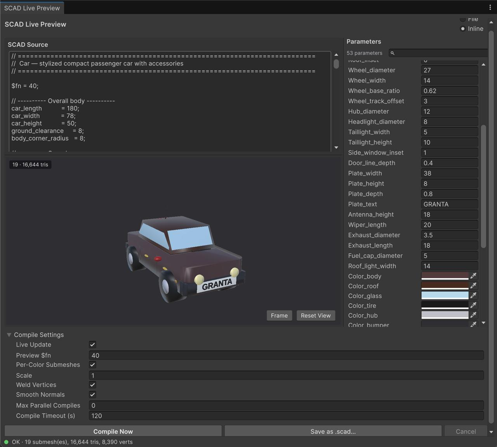
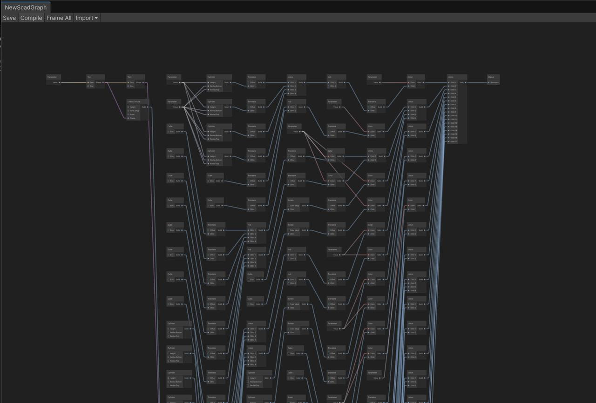

# UnitySCAD

Import parametric **OpenSCAD** (`.scad`) files as Unity meshes, with live parameter editing and a Shader-Graph-style node editor.



## Features

- **ScriptedImporter** for `.scad` files — drop into `Assets/`, get a ready-to-use prefab
- **Customizer-style parameter parsing** — `// [min:max]` ranges, `// [option, option]` dropdowns, hex colors, RGB vectors, booleans, descriptions, groups
- **Live Preview window** — embedded 3D viewport with orbit controls, debounced background recompile, process cancellation on every edit
- **Node graph editor** (`.scadgraph`) — visual authoring with ~25 typed nodes (primitives, transforms, boolean ops, extrusions, math, vectors); reverse-imports existing `.scad` files into an editable graph
- **Per-color submeshes** — separates geometry by `color()` calls into tinted submesh materials
- **Compile cache** — SHA-256-keyed disk cache, re-opening a prior parameter state is instant
- **OpenSCAD auto-installer** — downloads the 2025.06.22 snapshot (with the fast Manifold CSG backend) into a per-user cache; no manual PATH setup
- **URP / HDRP / Built-in RP** — materials resolve to the active render pipeline's default Lit shader

## Requirements

- Unity **6000.0** or newer
- OpenSCAD binary (the plugin can download it for you)

## Install

### Via Package Manager (Git URL)

`Packages/manifest.json`:

```json
{
  "dependencies": {
    "com.timskap.unityscad": "https://github.com/timskap/UnitySCAD.git"
  }
}
```

### Pinning a version

```json
"com.timskap.unityscad": "https://github.com/timskap/UnitySCAD.git#v0.1.0"
```

## First-time setup

1. Open **Unity → Settings → Preferences → SCAD Plugin**.
2. Click **Download and Install OpenSCAD 2025.06.22**. Waits ~1 minute; installs into a per-user cache shared across all your Unity projects.

## Usage

### Imported assets

Drop a `.scad` file into `Assets/`. Unity imports it as a GameObject prefab with `MeshFilter` + `MeshRenderer`. The Inspector exposes every top-level variable in the file as an editable parameter. Click **Apply** to recompile.

By default **Skip Compile** is on so heavy models don't freeze Unity on first import — uncheck it when you want the real mesh.

### Live Preview window

**Window → SCAD Live Preview**. Two modes:

- **File** — drop a `.scad` asset, edit parameters, see the mesh update in the embedded viewport. **Commit to Asset** bakes the current state into the importer meta.
- **Inline Text** — paste SCAD code directly, iterate, then **Save as .scad Asset…** writes it to the project.

Live Update debounces edits, cancels in-flight compiles on every keystroke, and overrides `$fn` for fast preview (configurable). Parameters change → mesh updates in a few hundred ms on a reasonable model.

### Per-color output

SCAD files like this:

```scad
C_wall = [0.55, 0.38, 0.24];
C_roof = [0.28, 0.17, 0.12];
color(C_wall) cube([10, 10, 5]);
color(C_roof) translate([0, 0, 5]) cube([10, 10, 1]);
```

produce a mesh with **two submeshes** and **two materials**, each tinted appropriately. The plugin achieves this by running OpenSCAD once per distinct `color()` value, with an injected `color` override module filtering geometry per pass — all passes run in parallel.

**Limitation**: works when `color()` wraps standalone top-level parts. `color()` applied inside a `difference()` positive is handled correctly. RGB-vector and hex-string colors are supported; nested `color()` calls are not.

## Parameter syntax

```scad
// Dimension group header
/* [Dimensions] */

// Width of the box
width = 20; // [5:100]

// Height with step
height = 10; // [5:0.5:50]

// Integer dropdown
quality = 30; // [10, 20, 30, 60]

// String dropdown
label = "Small"; // ["Small", "Medium", "Large"]

// Boolean
hollow = false;

// Hex color (rendered as color picker)
accent = "#C3F9BC";

// RGB-vector color (rendered as color picker)
wall = [0.55, 0.38, 0.24];
```

Only the top-level variables **before the first `module` / `function`** are treated as parameters (matches OpenSCAD Customizer semantics). Expressions like `computed = a + b;` are filtered out.

## Node graph (`.scadgraph`)

Visual, Shader-Graph-style authoring for OpenSCAD geometry. Create with **Assets → Create → SCAD → Graph**; double-click to open in the editor window.



- Search menu (Space or right-click) is auto-populated by reflecting `[ScadNode]` attributes; ~25 typed nodes covering primitives (cube/sphere/cylinder/square/circle/polygon/polyhedron/text), transforms (translate/rotate/scale/mirror/color/offset/resize), boolean ops (union/difference/intersection/hull/minkowski), extrusion (linear_extrude/rotate_extrude/projection), math, and vector ops.
- Ports are typed: Number / Vector2 / Vector3 / Boolean / String / Color / Solid / Shape / Any, with `Number → Vector` broadcast for SCAD-style shortcuts. Compatible ports auto-connect.
- Exposed graph parameters emit as SCAD top-level variables, so they're live-editable both in the graph and downstream.

### SCAD source import

The **Import** dropdown in the toolbar pastes SCAD source or opens a `.scad` file and produces a fully expanded graph. Right-clicking a `.scad` asset in the Project window gives the same entry point via **SCAD → Convert .scad to Graph**.

How it works:

1. A preprocessor extracts every `module`/`function` definition into the graph's preamble (preserved verbatim, so OpenSCAD always sees them) and also re-parses each body into AST.
2. The main parser handles the remaining top-level code — assignments, module calls, SCAD range literals `[start:step:end]`, arithmetic expressions.
3. The graph builder inlines user-defined module calls with full argument/local-variable substitution, unrolls `for`-loops over constant ranges, and wires identifier references back to `ParameterNode`s so live edits stay wired through.
4. Anything outside the supported subset (`if`/`else`, non-constant ranges, unknown modules without parsed AST) falls back to `CustomStatementNode` with the SCAD text preserved — the graph always compiles.

See [Documentation~/NodeGraph.md](Documentation~/NodeGraph.md) for the full architectural reference.

## Performance

- **Snapshot OpenSCAD + Manifold backend**: auto-installed; 10–50× faster CSG than 2021.01 stable.
- **Parallel multi-color compile**: N colors run in `min(cores, N)` concurrent processes.
- **Disk cache**: 512 MB ring. Reopening a prior parameter combo is instant.
- **Preview `$fn` override**: live preview uses low `$fn` (default 12) for fast iteration; commit/import uses the file's own value.

## License

MIT. See [LICENSE](LICENSE).

OpenSCAD itself is GPL-2.0 and is **not** redistributed by this plugin — the auto-installer downloads it on your machine from `files.openscad.org` on demand.
